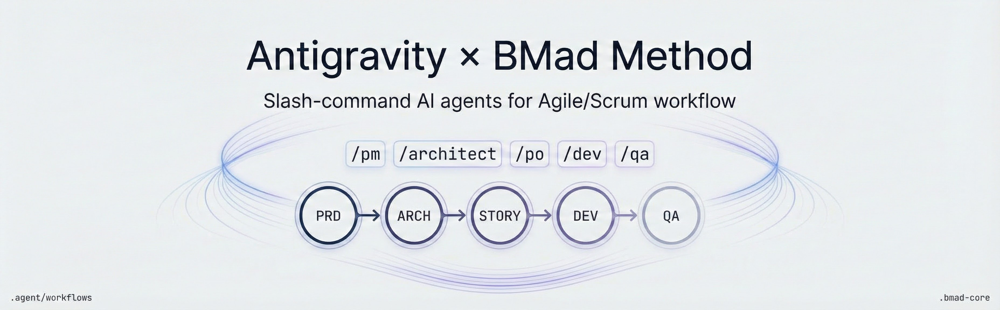
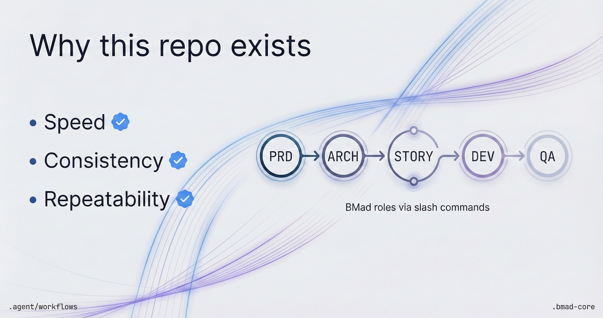
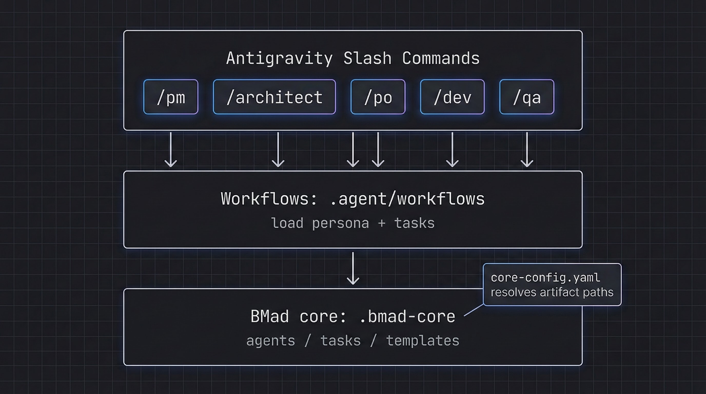

# Antigravity × BMad Method — Config Template

Language: English • `README_RU.md`

A ready-to-clone repository template that wires the **BMad Method** (agentic Agile/Scrum roles, tasks, and handoffs) into the **Antigravity** agent environment via native **slash commands**.

If you want a predictable “PRD → Architecture → Stories → Implementation → QA gate” workflow powered by AI agents, this repo gives you the wiring and conventions so you can start immediately.

## Why this repo exists

- Reduce time-to-first-PRD: run `/pm`, get structure and artifacts fast.
- Keep teams aligned: consistent roles (`/po`, `/architect`, `/dev`, `/qa`) and explicit handoffs.
- Make agent work repeatable: tasks and checklists live in markdown, not in ad-hoc prompts.



## What’s included

- **Antigravity workflows** in `.agent/workflows/` (e.g. `/pm`, `/dev`, `/qa`) that orchestrate BMad roles.
- **Codex-friendly agent memory** in `AGENTS.md` (generated by BMAD-METHOD; helpful for Codex CLI/Web too).
- **Workflow generator**: `.gemini/transpose_bmad.py` to (re)generate `.agent/workflows` from `.bmad-core`.

> Note: the workflows reference `.bmad-core/...` (agents/tasks/templates). If `.bmad-core` is missing in your clone, install or vendor it (see Quick start).

## How it works



## Slash commands (agents)

Use these slash commands in Antigravity to activate specific BMad roles:

| Command | Role | Typical outcomes |
| :--- | :--- | :--- |
| `/pm` | **Product Manager** | PRD discovery, requirements, user stories framing |
| `/architect` | **System Architect** | Architecture, ADR-style decisions, technical plan |
| `/po` | **Product Owner** | Backlog shaping, story quality, acceptance criteria |
| `/dev` | **Developer** | Implement stories, iterate, refactor safely |
| `/qa` | **Test Architect** | Test strategy, QA gate, risk profiling |
| `/ux` | **UX Expert** | UX flows, UI specs, copy and IA |
| `/analyst` | **Analyst** | Market/competitive research, synthesis |
| `/sm` | **Scrum Master** | Process alignment, story readiness, next-step guidance |
| `/master` | **BMad Master** | General-purpose helper for the framework |
| `/orchestrator` | **Orchestrator** | High-level coordination across roles |

## Quick start

1. **Use as a template**
   ```bash
   git clone https://github.com/salacoste/antigravity-bmad-config.git my-project
   cd my-project
   rm -rf .git
   git init
   ```

2. **Ensure `.bmad-core` exists**

   This repo’s workflows expect BMad core files at `.bmad-core/` (agents, tasks, templates).

   - Option A (recommended): install/update via BMAD-METHOD (optional IDE presets via `-i`)
     ```bash
     npx bmad-method install -f
     ```
     Optional examples:
     ```bash
     npx bmad-method install -f -i codex
     npx bmad-method install -f -i cursor claude-code
     ```
   - Option B: vendor `.bmad-core` into this repo from your preferred source (and commit it for reproducibility).

3. **Start planning in Antigravity**
   - Run `/pm` to begin defining your project requirements.
   - Follow agent prompts to create your first PRD and backlog artifacts.

## Maintenance (updating workflows)

If you update `.bmad-core` (agents/tasks), regenerate Antigravity workflows:

```bash
python3 .gemini/transpose_bmad.py
```

## Repository structure

- `.agent/workflows/` — Antigravity slash-command workflows (`/pm`, `/dev`, `/qa`, ...)
- `.bmad-core/` — BMad core (agents/tasks/templates); required by the workflows
- `AGENTS.md` — Codex-friendly agent memory (generated by BMAD-METHOD)
- `.gemini/transpose_bmad.py` — regenerates workflows from `.bmad-core`

## SEO keywords (for GitHub search)

Antigravity, BMad Method, BMAD-METHOD, AI agents, agentic workflow, agile, scrum, product manager agent, architecture agent, user stories, QA gate, workflow automation, slash commands, project template.

## Repository marketing kit

See `MARKETING.md` for suggested GitHub description/topics and image prompts (banner + social preview).

For GitHub’s Social Preview image, upload `assets/social-card.jpg` in repo settings.
